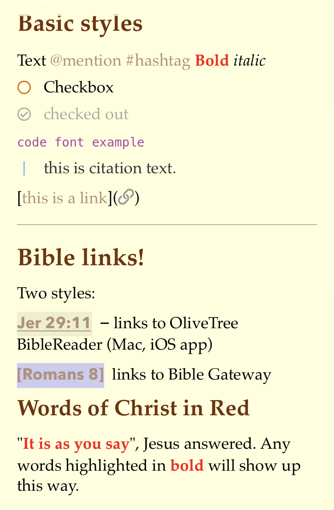
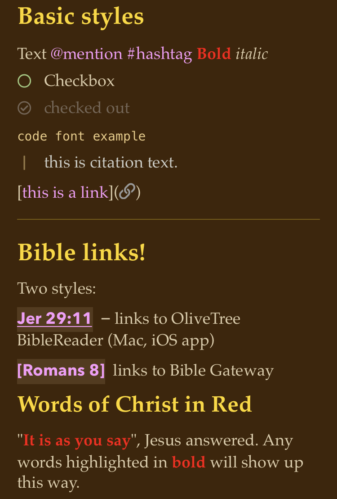

# NPTheme-Scripture
NotePlan app theme with parchment-and-leather look, and Bible cross-links

# Day and Night Themes

# Overview
This is a theme for the awesome Mac and iOS app ["NotePlan"](https://apps.apple.com/us/app/noteplan-3/id1505432629)
The author, Eduard Metzger, recently added theming support, so this prompted me to try my hand 
at a simple theme that gave the feel of real paper, like many Bible apps do.  
On top of this, the "bold" font was repurposed to be "words of Christ" in bright red.

# Basic Use
This theme will highlight any verse references in your notes that have ANY combination of the following letters and numbers:
[#]Book chap#:verse#[-range#]

Examples:
**1Pe 1:20-21**
**Romans 2:7**

("Book" is case-independent, and is ANY alpha string). Verse # and range are optional.  

NOTE: In its standard form, chapter-only references will not be parsed, as it leads to too many false hits on other note text.  However, a solution is provided in the Alternate form described below. 

# Links!
Serendipitously, there is a linking feature in the theming mechanism, using simple Javascript/JSON regular expressions.   
So for any text matching a designated regexp, we can not only highlight the matched verse reference, but we can also send the matched text to a URL handler that can either open another app (X-url-callback) or append it to a base URL.  
This is a great option for Bible verse references in a note, sending the user straight to his/her favorite online Bible!

There are presently *two styles* of links:

1. Standard: OliveTree BibleReader
A citation like "John 3:16" will be highlighted, and clicking will send the user to the OliveTree BibleReader app, displaying the verse in its surrounding context.  This is my preferred app, and is supported on both Mac and iOS devices. Presently, the URL scheme only brings up verses in a popup window.  

2. Alternate: Bible Gateway 
A verse ref delimited with single brackets, e.g. [John 3:16], will send the user to Bible Gateway website via the default browser, using the default Bible version the user has set up there. Delimited text will allow chapter-only references, e.g. "Romans 2".  Note that Bible Gateway also displays *only* the specific verses or ranges that are sent. 

3. Other linked Bibles?
You are of course free to copy and modify the linking schemes to your liking, even creating new delimiters as alternatives others could use. 

# Suggestions
In the wee hours of your morning Bible studies, try this theme along with iOS "Night Shift" to tune the warmth of the colors!

# Roadmap
The following features / changes are planned:
- New styles for highlighting text
- Link to BibleGateway (possibly retain OliveTree with alternate delimiters)
- Dark theme!
- Better regexp restricted to matching canonical Bible book names and abbreviations

Please feel free to fork this repo and put in pull requests for changes you
think would benefit others

Thank you, and God bless!
-Rob Grace ("gracius" on Discord)
